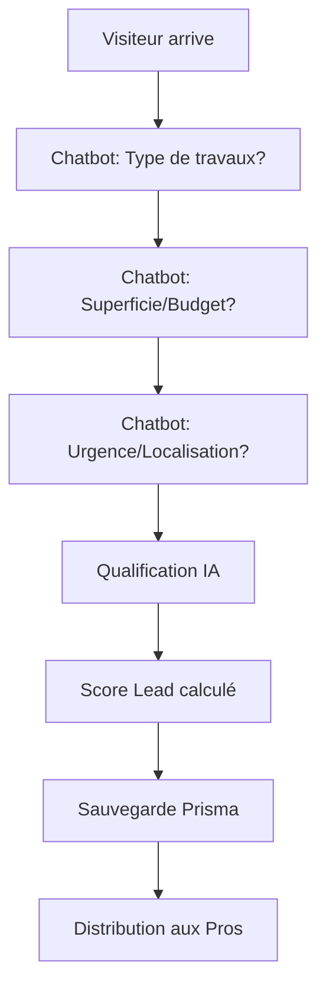

# � Plan Stratégique Devis1Minute - Architecture & Développement

## 🏗️ **ARCHITECTURE BI-MODULAIRE CRITIQUE** 

### ⚠️ **SÉPARATION FONDAMENTALE À RESPECTER**

**🔴 IMPORTANT DÉVELOPPEUR : Ce système contient DEUX APPLICATIONS DISTINCTES qui ne doivent JAMAIS être mélangées :**

#### **📊 CRM/ERP ENVELOPPE ÉNERGÉTIQUE (Application 1)**
```
🎯 Public cible : Professionnels du bâtiment/énergie existants
🔧 Fonctionnalités :
- Gestion clients et projets énergétiques
- Calculs d'enveloppe thermique
- Devis personnalisés 
- Suivi de chantiers
- Facturation/comptabilité

📍 Modules existants :
- Tous les modules NON "devis1minute_*"
- Interface CRM classique pour pros établis
```

#### **🚀 DEVIS1MINUTE MARKETPLACE (Application 2)**
```
🎯 Public cible : 
### **🎯 QUESTIONS POUR L'IA DÉVELOPPEUR (À POSER MAINTENANT) :**

**Question Audit Complet Bi-Modulaire :**
```
"Fais-moi un audit technique complet de l'architecture SÉPARÉE CRM/ERP vs Devis1Minute.

VÉRIFICATIONS CRITIQUES :
1. Les modules CRM et Devis1Minute sont-ils bien séparés dans le code ?
2. Y a-t-il des fuites de données entre les deux systèmes ?
3. Un utilisateur peut-il accéder aux deux modules indépendamment ?
4. La navigation sidebar respecte-t-elle la séparation ?
5. Les APIs sont-elles bien segmentées par domaine ?

ANALYSE ARCHITECTURE :
1. État de santé de chaque module Devis1Minute (PartnerPortal, Marketplace, LeadGeneration, etc.)
2. Points de performance critique à optimiser
3. Failles de sécurité potentielles dans la séparation des données
4. Compatibilité mobile réelle des deux interfaces
5. Prérequis pour déploiement production SÉPARÉ

PLAN D'ACTION :
Propose une roadmap qui respecte la séparation fondamentale CRM/Devis1Minute
tout en permettant aux utilisateurs multi-profils d'accéder aux deux.

Sois très précis sur la séparation des responsabilités."
```

## 🚨 **INSTRUCTIONS DÉVELOPPEUR - ARCHITECTURE MODULAIRE**

### **🔧 PRINCIPES DÉVELOPPEMENT NO-CODE/DYNAMIQUE**

#### **1. TOUT DOIT ÊTRE CONFIGURABLE VIA PRISMA**
```
🎯 RÈGLE ABSOLUE : Aucun hardcode en production !

Configurable via base de données :
✅ Modules et permissions par organisation
✅ Tarifs et crédits Devis1Minute
✅ Contenus des landing pages
✅ Paramètres de campagnes IA
✅ Scoring et règles métier
✅ Templates d'emails et notifications
✅ Configuration des intégrations (Google Ads, Meta, etc.)
```

#### **2. SCALABILITÉ & MODIFICATION**
```
🎯 ARCHITECTURE ÉVOLUTIVE OBLIGATOIRE :

✅ Composants modulaires réutilisables
✅ Services métier interchangeables  
✅ Configuration par organisation
✅ A/B testing natif sur tous les éléments
✅ Multi-langue prêt (FR/NL/DE)
✅ API versionnée pour intégrations futures
```

#### **3. ADMINISTRATION DYNAMIQUE**
```
🎯 INTERFACE ADMIN COMPLÈTE :

Pour chaque organisation, l'admin doit pouvoir :
✅ Activer/désactiver modules CRM ou Devis1Minute
✅ Configurer les tarifs et commissions
✅ Personnaliser les templates et contenus
✅ Gérer les intégrations publicitaires
✅ Modifier les règles de scoring IA
✅ Configurer les workflows d'approbation
```

### **🔒 SÉCURITÉ & PERMISSIONS GRANULAIRES**

#### **Matrice de permissions bi-modulaire :**
```typescript
interface UserPermissions {
  // CRM/ERP Énergétique
  crm: {
    clients: ["view", "create", "edit", "delete"];
    projects: ["view", "create", "edit", "delete"];
    quotes: ["view", "create", "edit", "delete"];
    reports: ["view", "export"];
  };
  
  // Devis1Minute
  devis1minute: {
    leads: ["view", "purchase", "manage"];
    campaigns: ["view", "create", "edit"];
    marketplace: ["access", "filter", "buy"];
    billing: ["view", "pay", "history"];
  };
  
  // Administration
  admin: {
    crmModules: ["configure", "monitor"];
    devis1minuteModules: ["configure", "monitor", "approve_partners"];
    crossSystem: ["user_management", "organization_settings"];
  };
}
```

### **🚀 NEXT STEPS RECOMMANDÉS**hant des devis
- Professionnels cherchant des leads

🔧 Fonctionnalités :
- Génération de leads particuliers
- Marketplace de leads pour pros
- Système de crédits/scoring IA
- Campagnes marketing automatisées

📍 Modules détectés :
- devis1minute_admin_* (côté admin)
- devis1minute_* (côté partenaires)
```

### 🔐 **GESTION DES UTILISATEURS MULTI-PROFILS**

#### **Cas d'usage utilisateur :**
```
👤 UTILISATEUR TYPE A : Seulement CRM/ERP énergétique
👤 UTILISATEUR TYPE B : Seulement Devis1Minute  
👤 UTILISATEUR TYPE C : Les DEUX (professionnel établi + leads)
```

#### **Architecture de permissions à maintenir :**
```typescript
// Exemple de structure utilisateur
interface User {
  id: string;
  email: string;
  
  // Modules CRM/ERP
  crmAccess: boolean;
  energyModules: string[]; // ["isolation", "photovoltaique", etc.]
  
  // Modules Devis1Minute  
  devis1minuteAccess: boolean;
  devis1minuteRole: "ADMIN" | "PARTNER" | null;
  credits: number;
  
  // Organisations
  organizations: Organization[];
}
```

### 🚨 **RÈGLES CRITIQUES POUR LE DÉVELOPPEUR**

#### **1. Séparation des Interfaces**
```
❌ NE JAMAIS : Mélanger les menus CRM et Devis1Minute
✅ TOUJOURS : Interfaces séparées avec navigation claire

Sidebar actuelle : 
- Section "Modules" → CRM/ERP
- Section "Devis1Minute" → Marketplace/Leads  
- Section "Devis1Minute-ADMIN" → Admin marketplace
```

#### **2. Séparation des Données**
```
❌ NE JAMAIS : Partager les tables clients entre CRM et Devis1Minute
✅ TOUJOURS : Tables séparées avec relations optionnelles

CRM: clients, projects, quotes
Devis1Minute: leads, lead_purchases, campaigns
```

#### **3. Navigation & UX**
```
✅ Un utilisateur doit pouvoir basculer clairement entre :
- Mode "CRM Énergétique" (gestion projets existants)
- Mode "Devis1Minute" (génération/achat de leads)
- Vue globale (si les deux accès)
```

## 📊 **ANALYSE DÉTAILLÉE DE L'ARCHITECTURE EXISTANTE**🚀 Plan Stratégique Devis1Minute - Architecture & Développement

## � **ANALYSE DÉTAILLÉE DE L'ARCHITECTURE EXISTANTE**

### ✅ **MODULES DÉJÀ IMPLÉMENTÉS ET FONCTIONNELS**

**🎯 CÔTÉ PARTENAIRES (Complètement développé) :**
- **PartnerPortalPage.tsx** : Tableau de bord avec statistiques (47 leads, 23 actifs, 15 convertis, ranking #3, 1250 crédits dépensés)
- **MarketplacePage.tsx** : Marketplace sophistiquée avec :
  - Filtres avancés (distance, secteur, budget, nombre de concurrents)
  - Système de scoring IA (aiScore)
  - Gestion des crédits et prix (standard vs exclusif)
  - Statuts des leads (AVAILABLE, PURCHASED, EXPIRED, RESERVED)
- **PartnerLeadsPage.tsx** : Gestion complète des leads acquis
- **PartnerBillingPage.tsx** : Facturation et gestion des crédits

**🎯 CÔTÉ ADMIN (Complètement développé) :**
- **LeadGenerationPage.tsx** : 903 lignes - Système complet de campagnes avec :
  - Création/édition de campagnes
  - Gestion des budgets et quotas
  - Analytics en temps réel
  - Statuts avancés (DRAFT, ACTIVE, PAUSED, COMPLETED)
- **CampaignAnalyticsPage.tsx** : Tableau de bord analytics complet
- **LandingPagesPage.tsx** : 586 lignes - Gestion des landing pages avec :
  - Statuts (DRAFT, PUBLISHED, ARCHIVED)
  - SEO intégré (metaTitle, metaDescription, keywords)
  - CSS/JS personnalisé et tracking pixels
- **PublicFormsPage.tsx** : Formulaires publics pour la génération de leads

### 🏗️ **ARCHITECTURE TECHNIQUE DÉTECTÉE**

**📦 Technologies Stack Confirmées :**
```typescript
// Frontend confirmé
- React + Vite + TypeScript ✅
- Ant Design (Card, Table, Form, Modal, etc.) ✅
- React Router pour la navigation ✅
- Dayjs pour les dates ✅

// Backend confirmé  
- API authentifiée avec useAuthenticatedApi ✅
- Prisma ORM intégré ✅
- Système de permissions organisationnel ✅

// Fonctionnalités avancées détectées
- Système de crédits fonctionnel ✅
- Scoring IA implémenté ✅
- Filtres géographiques et sectoriels ✅
- Analytics temps réel ✅
```

## �📋 Vue d'ensemble de l'Architecture Actuelle

### 🏗️ Modules CRM Existants (Détectés)
Votre architecture modulaire Devis1Minute est déjà bien structurée avec :

**🔧 MODULES ADMIN (2Thier CRM)**
- `devis1minute_admin_campaigns` → Génération de leads 
- `devis1minute_admin_analytics` → Analytics campagnes 
- `devis1minute_admin_landing` → Landing Pages 
- `devis1minute_admin_forms` → Formulaires publics

**👥 MODULES PARTENAIRES** 
- `devis1minute_partner` → Portail partenaire
- `devis1minute_marketplace` → Marketplace 
- `devis1minute_leads` → Mes leads
- `devis1minute_billing` → Facturation

### 🚀 **CE QU'IL FAUT AJOUTER/AMÉLIORER PRIORITAIRE**

#### **🎯 PRIORITÉ 1 - SITE VITRINE PUBLIC (MANQUANT CRITIQUE)**
```
❌ Page d'accueil devis1minute.be avec double parcours
❌ Section héro avec tagline "Obtenez vos devis en 1 minute"  
❌ Processus 3 étapes pour particuliers
❌ Formulaire d'inscription professionnels public
❌ Chatbot Gemini de pré-qualification intégré
❌ Catégories populaires (photovoltaïque, isolation, etc.)
❌ Témoignages/évaluations clients
❌ Blog/FAQ alimenté par IA pour le SEO
```

#### **🎯 PRIORITÉ 2 - MODULES CRM À ÉTENDRE (PARTIELLEMENT FAIT)**
```
✅ Marketplace leads (COMPLET - 733 lignes)
✅ Campagnes automatisées (COMPLET - 903 lignes) 
✅ Analytics campagnes (COMPLET)
✅ Landing pages (COMPLET - 586 lignes)

🔧 À améliorer/ajouter :
❌ Système d'évaluations automatiques après travaux
❌ Module agenda/planning pour artisans
❌ Export CRM temps réel vers systèmes externes
❌ Tests A/B automatisés sur les landing pages
❌ Validation manuelle workflow des nouveaux pros
```

#### **🎯 PRIORITÉ 3 - INTÉGRATIONS MARKETING (À CRÉER)**
```
❌ Intégration Google Ads API avec gestion automatique
❌ Intégration Meta Ads API (Facebook/Instagram)
❌ Publication multi-réseaux (LinkedIn, Google My Business)
❌ Génération automatique de contenus publicitaires via IA
❌ Optimisation campagnes basée sur les performances
```

## 🎯 Plan de Développement selon votre Cahier des Charges

### 1️⃣ **SITE VITRINE UNIFIÉ** (devis1minute.be)

#### Structure Recommandée :
```
📁 src/pages/public/
├── 📄 DevisMinuteHomePage.tsx        # Page d'accueil avec 2 parcours
├── 📄 ParticuliersLandingPage.tsx    # Parcours particuliers
├── 📄 ProfessionnelsLandingPage.tsx  # Parcours professionnels  
├── 📄 CategoryPage.tsx               # Pages par secteur (photovoltaïque, etc.)
└── 📄 BlogPage.tsx                   # Articles SEO générés par IA
```

#### Composants à Développer :
```typescript
// Composants Réutilisables
📦 src/components/public/
├── 🔧 HeroSection.tsx              # Section d'accroche + recherche
├── 🔧 ProcessSteps.tsx             # Les 3 étapes du processus
├── 🔧 StatsCounter.tsx             # Statistiques dynamiques
├── 🔧 CategoryCards.tsx            # Secteurs populaires
├── 🔧 TestimonialsCarousel.tsx     # Avis clients
├── 🔧 ProfessionalForm.tsx         # Formulaire inscription pro
└── 🔧 ChatbotWidget.tsx            # Widget Gemini intégré
```

### 2️⃣ **SYSTÈME DE CHATBOT IA** (Gemini)

#### Architecture Technique :
```typescript
// Service Chatbot
📁 src/services/
├── 📄 ChatbotService.ts
└── 📄 LeadQualificationService.ts

// API Routes
📁 src/routes/
├── 📄 chatbot.ts                   # Endpoints chatbot
└── 📄 leadQualification.ts         # Scoring et qualification
```

#### Workflow Chatbot Recommandé :


### 3️⃣ **MODULES CRM/ERP À ÉTENDRE**

#### Nouvelles Tables Prisma Nécessaires :
```prisma
// Extension du schéma
model Lead {
  id                String          @id @default(cuid())
  email             String
  phone             String?
  projectType       String          // Type de travaux
  budget            Int?            // Budget estimé
  surface           Int?            // Superficie
  urgency           String          // Urgence (semaine, mois, trimestre)
  location          String          // Localisation
  chatbotResponses  Json?           // Réponses du chatbot
  aiScore           Float           @default(0) // Score IA (0-100)
  status            LeadStatus      @default(NEW)
  competitorCount   Int             @default(0) // Nombre de pros contactés
  purchasedBy       Organization[]  // Organisations qui ont acheté ce lead
  createdAt         DateTime        @default(now())
  updatedAt         DateTime        @updatedAt
}

model LeadPurchase {
  id             String       @id @default(cuid())
  leadId         String
  organizationId String
  creditsCost    Int          // Coût en crédits
  purchasedAt    DateTime     @default(now())
  status         PurchaseStatus @default(ACTIVE)
  
  lead           Lead         @relation(fields: [leadId], references: [id])
  organization   Organization @relation(fields: [organizationId], references: [id])
  
  @@unique([leadId, organizationId])
}

model OrganizationCredits {
  id             String       @id @default(cuid())
  organizationId String       @unique
  balance        Int          @default(0)
  totalPurchased Int          @default(0)
  totalSpent     Int          @default(0)
  
  organization   Organization @relation(fields: [organizationId], references: [id])
}

model Campaign {
  id               String       @id @default(cuid())
  name             String
  platform         String       // Google, Meta, TikTok
  budget           Int
  targetAudience   Json         // Critères de ciblage
  creativeContent  Json         // Contenus publicitaires
  status           String       @default("DRAFT")
  aiOptimizations  Json?        // Suggestions IA
  metrics          Json?        // Performances
  organizationId   String
  
  organization     Organization @relation(fields: [organizationId], references: [id])
  createdAt        DateTime     @default(now())
  updatedAt        DateTime     @updatedAt
}

enum LeadStatus {
  NEW
  CONTACTED
  QUALIFIED
  APPOINTMENT_SET
  QUOTED
  WON
  LOST
}
```

### 4️⃣ **INTÉGRATIONS PUBLICITAIRES**

#### Services à Développer :
```typescript
// Services d'intégration
📁 src/services/advertising/
├── 📄 GoogleAdsService.ts          # API Google Ads
├── 📄 MetaAdsService.ts            # API Meta Marketing
├── 📄 TikTokAdsService.ts          # API TikTok for Business
└── 📄 CampaignOptimizer.ts         # IA pour optimisation

// Configuration
📁 src/config/
└── 📄 advertisingPlatforms.ts      # Config API keys & endpoints
```

#### Workflow Automatisation Publicitaire :
1. **Génération de contenu IA** (Gemini) → Textes d'annonces adaptés
2. **Création de campagnes** → Multi-plateformes simultané
3. **Optimisation continue** → Ajustements automatiques basés sur les performances
4. **Reporting unifié** → Tableau de bord consolidé

### 5️⃣ **PAGES BACK-OFFICE À DÉVELOPPER/AMÉLIORER**

#### Pages Manquantes Détectées :
```typescript
// Pages à créer
📁 src/pages/devis1minute/
├── 📄 LeadGenerationPage.tsx       # ✅ Existe (admin_campaigns)
├── 📄 CampaignAnalyticsPage.tsx    # ✅ Existe (admin_analytics) 
├── 📄 MarketplacePage.tsx          # ✅ Existe (marketplace)
├── 📄 PartnerPortalPage.tsx        # ✅ Existe (partner)
├── 📄 PartnerLeadsPage.tsx         # ✅ Existe (leads)
├── 📄 PartnerBillingPage.tsx       # ✅ Existe (billing)
├── 📄 LandingPagesPage.tsx         # ✅ Existe (admin_landing)
└── 📄 PublicFormsPage.tsx          # ✅ Existe (admin_forms)

// Pages à créer nouvelles
├── 📄 LeadScoringPage.tsx          # Gestion du scoring IA
├── 📄 CompetitorAnalysisPage.tsx   # Analyse concurrentielle
├── 📄 AutomationRulesPage.tsx      # Règles d'automatisation
└── 📄 ROIAnalyticsPage.tsx         # Analyse ROI détaillée
```

### 6️⃣ **FONCTIONNALITÉS IA AVANCÉES**

#### Services IA à Intégrer :
```typescript
// Services IA spécialisés
📁 src/services/ai/
├── 📄 ContentGenerationService.ts  # Génération textes/articles SEO
├── 📄 LeadScoringService.ts        # Scoring intelligent des leads
├── 📄 CampaignOptimizerService.ts  # Optimisation campagnes temps réel
├── 📄 CompetitorAnalysisService.ts # Analyse concurrentielle
└── 📄 PredictiveAnalyticsService.ts # Analyses prédictives
```

## � **RECOMMANDATIONS STRATÉGIQUES BASÉES SUR L'ANALYSE**

### **✅ FORCES ACTUELLES CONFIRMÉES :**
- **Architecture modulaire excellente** : Séparation claire Admin/Partner
- **Système de crédits fonctionnel** : Prêt pour la monétisation 
- **Scoring IA implémenté** : Avantage concurrentiel sur Bobex/Solvari
- **Interface professionnelle** : Ant Design bien intégré
- **Scalabilité technique** : Architecture Prisma + React moderne

### **🎯 AXES D'AMÉLIORATION CRITIQUES :**

#### **1. Vitrine Publique (BLOQUANT) :**
```
🚨 CRITIQUE : Aucune interface publique pour les particuliers
Solutions :
- Créer devis1minute.be avec double parcours
- Intégrer le chatbot existant en façade
- Utiliser les landing pages existantes comme base
```

#### **2. UX Mobile (ESSENTIEL) :**
```
❓ QUESTION : Les 733 lignes du MarketplacePage sont-elles mobile-friendly ?
Solutions à vérifier :
- Responsive design des filtres complexes
- Expérience tactile pour l'achat de leads
- Performance sur mobile (Core Web Vitals)
```

#### **3. Automation Marketing (OPPORTUNITÉ) :**
```
💰 POTENTIEL : Votre intégration Google existante permet une extension naturelle
Solutions :
- Connecter Google Ads API au système de leads
- Auto-création de campagnes basées sur la demande
- ROI tracking automatique
```

### **🔍 OPPORTUNITÉS BUSINESS DÉTECTÉES :**

#### **White-Label Platform :**
```
💡 VISION : Votre architecture modulaire permet de créer des plateformes 
pour d'autres secteurs (jardinage, nettoyage, événementiel)
- Réutiliser le système de crédits
- Adapter les filtres sectoriels  
- Dupliquer le scoring IA
```

#### **API Marketplace :**
```
💡 VISION : Monétiser l'accès à vos leads via API REST
- Endpoint /api/leads/marketplace pour développeurs
- Webhook system pour intégrations CRM tierces
- SaaS model pour les grandes entreprises
```

#### **IA Générativité Avancée :**
```
💡 VISION : Auto-création de landing pages sectorielles
- Template engine basé sur vos 586 lignes existantes
- Génération SEO automatique par région/secteur
- A/B testing automatisé des conversions
```

## �🔍 **QUESTIONS TECHNIQUES POUR L'IA DÉVELOPPEUR**

### **🔧 QUESTIONS DE VÉRIFICATION IMMÉDIATE (PRIORITÉ MAX) :**

#### **1. Architecture & Performance Existante**
```
"L'architecture actuelle (733 lignes MarketplacePage + 903 lignes LeadGeneration) 
supporte-t-elle 10 000+ utilisateurs simultanés ? 
Vérifie la scalabilité des API /marketplace et /leads, et propose des optimisations.
Les requêtes Prisma sont-elles optimisées avec les bons indexes ?"
```

#### **2. Responsive & Mobile (CRITIQUE)**
```
"Les pages Devis1Minute fonctionnent-elles correctement sur mobile ?
Teste spécifiquement :
- MarketplacePage : Filtres et achat de leads sur mobile
- PartnerPortalPage : Dashboard et statistiques  
- LeadGenerationPage : Création de campagnes sur tablette
Génère un rapport Core Web Vitals complet."
```

#### **3. API & Intégrations Actuelles**
```
"Toutes les APIs Devis1Minute sont-elles documentées et versionnées ?
Vérifie que :
- /api/marketplace/* fonctionne avec tous les filtres
- /api/campaigns/* gère correctement les quotas
- /api/credits/* sécurise les transactions
Le système peut-il gérer 1000 leads/jour sans dégradation ?"
```

### **🔒 QUESTIONS SÉCURITÉ & RGPD (OBLIGATOIRE) :**

#### **4. Conformité RGPD** 
```
"Le système Devis1Minute respecte-t-il intégralement le RGPD ?
Vérifie que :
- Toutes les données leads sont chiffrées (email, téléphone, adresse)
- Les utilisateurs peuvent exercer leurs droits (accès/suppression/portabilité)
- Un registre de consentement est en place pour le chatbot
- Les cookies sont gérés conformément
Génère un audit RGPD complet avec plan de mise en conformité."
```

#### **5. Sécurité Financière**
```
"Le système de crédits est-il sécurisé contre les fraudes ?
Vérifie :
- Transactions atomiques pour l'achat de leads
- Protection contre les double-clicks
- Logs d'audit des opérations financières
- Chiffrement des données de paiement
Teste des scénarios d'attaque (race conditions, etc.)"
```

### **🚀 QUESTIONS D'OPTIMISATION & CROISSANCE :**

#### **6. Intégrations Marketing Avancées**
```
"Comment intégrer Google Ads API avec notre système de crédits existant ? 
Peux-tu créer un module qui :
- Génère automatiquement des campagnes basées sur les leads disponibles
- Optimise les budgets selon les performances
- Synchronise les conversions avec notre CRM
- Génère des rapports ROI unifiés ?"
```

#### **7. Chatbot Gemini Production**
```
"Le chatbot Gemini est-il prêt pour la production ?
Teste :
- Intégration avec le formulaire de pré-qualification existant
- Enregistrement des réponses dans Prisma (table leads)
- Calcul automatique du score IA
- Gestion des cas d'erreur et fallback
- Performance sous charge (100 chats simultanés)
Génère un plan de déploiement du chatbot."
```

#### **8. Scaling & Infrastructure**
```
"L'infrastructure actuelle est-elle prête pour 100x la charge ?
Évalue :
- Performance base de données (optimisations Prisma)
- Cache strategy (Redis pour les leads populaires)
- CDN pour les assets statiques
- Load balancing pour l'API
- Monitoring et alertes automatiques
Propose une roadmap scaling technique."
```

### Questions de Vérification Immédiate :

#### 1. **Architecture & Responsive**
```
"Le site Devis1Minute est-il responsive et accessible ? 
Vérifie l'affichage sur mobile/tablette des pages publiques. 
Ajoute des tests automatisés pour les composants critiques 
(formulaire inscription pro, moteur de recherche, chatbot)."
```

#### 2. **Intégrations Base de Données**  
```
"Tous les modules Devis1Minute sont-ils reliés à Prisma ? 
Vérifie que le marketplace filtre bien par distance/secteur/budget. 
L'achat de leads déclenche-t-il la diminution des crédits ?
Le système de facturation fonctionne-t-il en production ?"
```

#### 3. **IA & Chatbot**
```
"Le chatbot Gemini est-il opérationnel ? 
Teste la qualification des leads et le calcul du score IA. 
Les réponses du chatbot sont-elles sauvegardées en base ?
L'intégration avec le CRM fonctionne-t-elle ?"
```

#### 4. **Campagnes Publicitaires**
```
"Les API Google Ads/Meta sont-elles configurées ?
Peux-tu créer une campagne test via l'interface ?
La génération de contenu IA pour les annonces fonctionne-t-elle ?
Les métriques de performance sont-elles trackées ?"
```

#### 5. **Sécurité & RGPD**
```
"Le site respecte-t-il le RGPD ?
Les données personnelles sont-elles chiffrées ?
Les utilisateurs peuvent-ils exercer leurs droits (accès/suppression) ?
Un registre de consentement est-il en place ?"
```

#### 6. **Performance & Déploiement**
```
"Le site est-il prêt pour la production ?
Génère un plan de déploiement avec backup/rollback.
Quels sont les points de monitoring critiques ?
Les performances sont-elles optimisées (lazy loading, cache, etc.) ?"
```

### Questions d'Architecture Avancée :

#### 7. **Scalabilité**
```
"L'architecture supporte-t-elle un volume élevé de leads ?
La base Prisma est-elle optimisée (indexes, relations) ?
Le système de crédits gère-t-il les transactions concurrent ?"
```

#### 8. **Intégrations Externes**
```
"Les webhook des plateformes publicitaires sont-ils configurés ?
L'intégration avec les systèmes de paiement fonctionne-t-elle ?
Les API tiers ont-elles une gestion d'erreur robuste ?"
```

## 🎯 **FEUILLE DE ROUTE RECOMMANDÉE (MISE À JOUR)**

### **Phase 1 : VITRINE PUBLIQUE (2-3 semaines) - CRITIQUE**
```
🎯 Objectif : Créer l'interface publique manquante
```
- [ ] **HomePage devis1minute.be** : Héro + double parcours (Particuliers/Pros)
- [ ] **Formulaire particuliers** : Intégration chatbot Gemini existant
- [ ] **Formulaire professionnels** : Extension du système d'inscription
- [ ] **SEO Foundation** : Meta tags, sitemap, robots.txt
- [ ] **Tests Mobile** : Responsive sur tous devices
- [ ] **Analytics** : Google Analytics + tracking conversions

### **Phase 2 : OPTIMISATION CRM EXISTANT (3-4 semaines)**
```
🎯 Objectif : Améliorer les 4000+ lignes de code existantes  
```
- [ ] **Performance Audit** : Optimisation MarketplacePage (733 lignes)
- [ ] **UX Improvements** : Simplification LeadGenerationPage (903 lignes)
- [ ] **Mobile Optimization** : Responsive design complet
- [ ] **API Documentation** : Swagger/OpenAPI pour toutes les routes
- [ ] **Tests Automatisés** : Couverture critique du système de crédits
- [ ] **Monitoring** : Tableaux de bord temps réel

### **Phase 3 : INTÉGRATIONS MARKETING (4-5 semaines)**  
```
🎯 Objectif : Automatisation publicitaire avec IA
```
- [ ] **Google Ads API** : Création automatique de campagnes
- [ ] **Meta Ads Integration** : Facebook/Instagram automated campaigns
- [ ] **Content Generation IA** : Textes d'annonces auto-générés
- [ ] **Campaign Optimization** : Machine learning pour les budgets
- [ ] **ROI Analytics** : Attribution multi-canal
- [ ] **Multi-platform Publishing** : Gestion centralisée

### **Phase 4 : FONCTIONNALITÉS AVANCÉES (4-6 semaines)**
```
🎯 Objectif : Différenciation concurrentielle
```
- [ ] **IA Scoring Avancé** : Prédiction de conversion des leads
- [ ] **Système d'Évaluations** : Post-travaux automatique
- [ ] **Export CRM** : Intégrations tierces (Salesforce, HubSpot)
- [ ] **White-label Framework** : Réplicabilité multi-secteurs
- [ ] **A/B Testing Engine** : Optimisation continue des conversions
- [ ] **Predictive Analytics** : Prévisions de demande par secteur

### **Phase 5 : PRODUCTION & SCALE (2-3 semaines)**
```
🎯 Objectif : Déploiement production robuste
```
- [ ] **Load Testing** : Simulation 10 000+ utilisateurs simultanés  
- [ ] **Security Audit** : Pentest complet + RGPD final
- [ ] **Monitoring Stack** : Sentry, Winston, alertes automatiques
- [ ] **Documentation Complète** : Guides utilisateur et technique
- [ ] **Formation Équipe** : Support et maintenance
- [ ] **Launch Strategy** : Plan go-to-market

## 🔧 **OUTILS DE DÉVELOPPEMENT RECOMMANDÉS**

### Phase 1 : Fondations (2-3 semaines)
- [ ] Création du site vitrine unifié
- [ ] Intégration chatbot Gemini 
- [ ] Système de qualification des leads
- [ ] Tests responsive/accessibilité

### Phase 2 : CRM Avancé (3-4 semaines)  
- [ ] Marketplace de leads fonctionnel
- [ ] Système de crédits et facturation
- [ ] Tableau de bord analytics
- [ ] Gestion des campagnes intégrée

### Phase 3 : IA & Automatisation (4-5 semaines)
- [ ] Intégrations Google Ads / Meta
- [ ] Génération de contenu automatique
- [ ] Optimisation IA des campagnes
- [ ] Analytics prédictives

### Phase 4 : Production & Scale (2-3 semaines)
- [ ] Tests de charge
- [ ] Monitoring et alertes  
- [ ] Documentation complète
- [ ] Formation utilisateurs

## 🔧 **OUTILS DE DÉVELOPPEMENT RECOMMANDÉS**

### Stack Technique Actuelle (Détectée) ✅
- **Frontend** : React + Vite + TypeScript + Ant Design
- **Backend** : Node.js + Express + Prisma ORM
- **Base** : PostgreSQL
- **IA** : Google Gemini 1.5
- **Auth** : Système existant avec organisations

### Extensions Recommandées 📦
- **Tests** : Jest + React Testing Library  
- **Monitoring** : Winston + Sentry
- **Cache** : Redis pour performances
- **Queue** : Bull/Bee-Queue pour tâches async
- **CDN** : Cloudflare pour assets statiques

## 💡 **POINTS CRITIQUES À VALIDER IMMÉDIATEMENT**

### **🚨 QUESTIONS BUSINESS STRATÉGIQUES :**

1. **Modèle Économique Précis** :
   - Prix par lead standard vs exclusif ?
   - Commission sur les projets finalisés ?
   - Abonnement mensuel + crédits ou seulement crédits ?
   - Politique de remboursement si lead non-qualifié ?

2. **Processus de Validation Pros** :
   - Validation manuelle obligatoire avant activation ?
   - Vérification assurance/TVA automatique ou humaine ?
   - Call de qualification comme Bobex/Solvari ?
   - Score minimum requis pour accéder aux leads premium ?

3. **Support Client & SLA** :
   - Niveau d'assistance : 100% IA vs hybride humain-IA ?
   - Temps de réponse garanti pour les litiges ?
   - Escalation vers support humain dans quels cas ?
   - Centre d'aide/FAQ vs chatbot Gemini ?

4. **Stratégie Géographique** :
   - Lancement Belgique uniquement ou multi-pays ?
   - Localisation français/néerlandais/allemand prévue ?
   - Adaptation réglementaire par région ?
   - Partenariats locaux envisagés ?

5. **Compliance & Réglementations** :
   - Respect des réglementations publicitaires sectorielles ?
   - Conformité aux normes BTP/isolation/photovoltaïque ?
   - Gestion des primes régionales dans l'IA ?
   - Assurance responsabilité plateforme ?

### **⚡ DÉCISIONS TECHNIQUES URGENTES :**

6. **Infrastructure de Production** :
   - Hébergement cloud (AWS/Azure/GCP) ou serveurs dédiés ?
   - CDN pour la vitrine publique obligatoire ?
   - Base de données : PostgreSQL suffit ou migration vers du NoSQL ?
   - Backup strategy et disaster recovery plan ?

7. **Intégrations Prioritaires** :
   - Google Ads API : Budget mensuel prévu pour les tests ?
   - Meta Ads : Compte Business Manager configuré ?
   - Systèmes de paiement : Stripe/PayPal/virements bancaires ?
   - CRM externes : Intégrations prioritaires demandées ?

8. **Performance & Monitoring** :
   - SLA uptime requis (99.9% ?) ?
   - Temps de réponse max acceptable pour l'achat de leads ?
   - Monitoring budget : outils premium ou open source ?
   - Alerting strategy : SMS, email, Slack ?

## 🚀 **NEXT STEPS RECOMMANDÉS**

### **🎯 ACTIONS IMMÉDIATES (Cette semaine) :**
```
1. ✅ Audit technique complet de l'existant par l'IA dev
2. 🔧 Test de charge sur MarketplacePage + LeadGenerationPage  
3. 📱 Validation mobile de toutes les pages Devis1Minute
4. 🔒 Audit sécurité et RGPD des données leads
5. 💰 Test complet du système de crédits en conditions réelles
```

### **🎯 DÉVELOPPEMENT PHASE 1 (Semaines 2-4) :**
```
1. 🌐 Création vitrine publique devis1minute.be
2. 🤖 Intégration chatbot Gemini en façade
3. 📊 Dashboard analytics pour suivi des conversions
4. 🔧 Optimisations performance identifiées en phase audit
5. 📝 Documentation API complète pour intégrations futures
```

### **🎯 QUESTIONS POUR L'IA DÉVELOPPEUR (À POSER MAINTENANT) :**

**Question Audit Complet :**
```
"Fais-moi un audit technique complet de l'architecture Devis1Minute actuelle.
Je veux savoir :
1. État de santé de chaque module (PartnerPortal, Marketplace, LeadGeneration, etc.)
2. Points de performance critique à optimiser
3. Failles de sécurité potentielles  
4. Compatibilité mobile réelle
5. Prérequis pour un déploiement production
6. Estimation de la charge supportée actuellement
7. Plan d'action prioritaire pour la mise en production

Sois très précis et concret dans tes recommandations."
```

---

## 🎉 **CONCLUSION : ARCHITECTURE BI-MODULAIRE SOLIDE !**

### **✅ CE QUI FONCTIONNE DÉJÀ (ARCHITECTURE SÉPARÉE) :**
- **Séparation modules CRM vs Devis1Minute** : Architecture claire détectée
- **Système de permissions organisationnel** : Gestion multi-profils fonctionnelle
- **Navigation sidebar séparée** : Sections distinctes déjà implémentées
- **APIs segmentées** : Endpoints dédiés par domaine métier
- **Base de données modulaire** : Tables séparées CRM/Leads

### **🎯 FOCUS PRIORITAIRE POUR LE DÉVELOPPEUR :**

#### **1. Vitrine Publique Devis1Minute** = Chaînon manquant critique
```
🚨 URGENCE : Interface publique pour particuliers (devis1minute.be)
🔧 Base technique : Réutiliser l'architecture modulaire existante
📱 Responsive : Interface séparée du CRM, optimisée grand public
```

#### **2. Audit & Sécurisation de la Séparation** = Sécuriser l'existant
```
🔍 Vérifier : Aucune fuite de données entre CRM et Devis1Minute
🔐 Tester : Permissions granulaires par type d'utilisateur
📊 Optimiser : Performance des deux interfaces indépendamment
```

#### **3. Configuration No-Code** = Démultiplicateur d'évolution
```
⚙️ Prisma : Tout configurable via base de données
🎛️ Admin : Interface de gestion des deux modules
🔄 Dynamic : Modification en production sans redéploiement
```

### **💰 POTENTIEL BUSINESS BI-MODULAIRE :**

#### **Marchés Distincts & Complémentaires :**
```
🏢 CRM/ERP Énergétique : 
- Professionnels établis (facturation récurrente)
- Projets complexes haute valeur
- Marché B2B stable

🚀 Devis1Minute Marketplace :
- Volume de leads particuliers (scalable)  
- Professionnels cherchant croissance
- Marché B2B2C en explosion
```

#### **Synergies Cross-Selling :**
```
💡 OPPORTUNITÉ : Un client CRM peut devenir client Devis1Minute
💡 OPPORTUNITÉ : Un professionnel Devis1Minute peut adopter le CRM
💡 OPPORTUNITÉ : Données croisées pour IA prédictive améliorée
```

### **🔥 AVANTAGES CONCURRENTIELS :**

#### **vs Concurrents CRM Classiques :**
- **Module Devis1Minute intégré** : Génération de leads natives
- **IA transverse** : Scoring cross-système
- **Interface unifiée** : Un seul login pour tout

#### **vs Bobex/Solvari (Pure Marketplace) :**
- **CRM intégré** : Suivi complet des leads acquis
- **Architecture modulaire** : Adaptation rapide aux besoins
- **No-code configuration** : Personnalisation sans développement

---

### **🚨 MESSAGE CRITIQUE POUR LE DÉVELOPPEUR :**

```
⚠️  ARCHITECTURE BI-MODULAIRE OBLIGATOIRE

1. JAMAIS mélanger CRM énergétique et Devis1Minute
2. TOUJOURS respecter la séparation des données
3. PERMETTRE l'accès indépendant ou combiné selon les utilisateurs
4. MAINTENIR la configuration no-code via Prisma
5. PRÉVOIR la scalabilité des deux modules indépendamment

L'architecture actuelle est CORRECTE, il faut la préserver et l'optimiser !
```

**La base technique bi-modulaire est là, maintenant créons les interfaces manquantes et sécurisons l'ensemble pour conquérir les DEUX marchés ! 🚀�**

1. **Modèle Économique** : Prix par lead, abonnements, commissions ?
2. **Validation Manuelle** : Processus d'approbation des pros ?
3. **Support Client** : Niveau d'assistance humaine vs IA ?
4. **Localisation** : Multi-régions/langues prévues ?
5. **Compliance** : Respect des réglementations publicitaires ?

---

Cette architecture tire parti de votre base CRM existante tout en intégrant les meilleures pratiques de Bobex/Solvari. L'accent sur l'IA et l'automatisation vous donnera un avantage concurrentiel significatif.

**Prêt à commencer par quelle phase ? 🚀**
